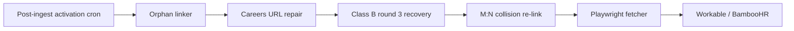

# Coverage Expansion — Future Work Plan

Prioritized backlog after the 2026-06-07 production rollout. Items are ordered by ROI vs. engineering risk.

---

## Tier 1 — High ROI, moderate effort (next 1–2 sprints)

### 1. Careers URL repair pipeline
**Problem:** 59/70 Class B round-2 candidates are `unresolvable` because `careersUrl` is wrong, redirects, or JS-rendered.  
**Scope:**
- Detect redirect chains (301/302) and update `careersUrl` when canonical host differs
- SERP fallback for `{company name} careers` when fetch fails
- Tag outcomes: `careers_url_repaired` / `careers_url_stale`
**Expected gain:** +15–30 tokens from round-2 pool  
**Risk:** Low if limited to fetch + redirect only (no Playwright)

### 2. Post-ingest activation loop
**Problem:** ~159 companies still show “has token, no active endpoint” because ingest queue must run and endpoints need `isActive=true` after jobs land.  
**Scope:**
- Cron or scheduled run of `activateRecoveredClassBPostIngest.ts`
- Extend post-ingest SQL to honor M:N `CompanyAtsEndpoint` links (partially done)
- Health check alert when `token_wired` + 0 jobs after 24h
**Expected gain:** Converts enqueued work into active coverage without new discovery  
**Risk:** Low

### 3. Orphan endpoint linker (confidence 3+)
**Problem:** **224** orphan active endpoints with no `companyId`.  
**Scope:** Expand `scripts/ingestion/linkOrphanEndpoints.ts` with slug match confidence ≥3, invalid-token guard  
**Expected gain:** +10–30 companies wired to existing crawls  
**Risk:** Low if confidence threshold stays high

### 4. Listing job count alignment
**Problem:** Company cards show stale job counts (inactive/expired jobs counted).  
**Scope:** Align `listCompaniesDiscovery` `jobCount` with `buildDiscoveryWhereSql`  
**Expected gain:** UX trust; no coverage change  
**Risk:** Low; may reduce displayed “open roles” numbers

---

## Tier 2 — Medium ROI, larger projects

### 5. Playwright / headless careers fetch
**Problem:** Lever/GH slugs hidden in client-rendered pages (Holmusk, Noibu, etc. show API 404 despite careers pages loading).  
**Scope:**
- Optional Playwright fetcher behind env flag `CAREERS_FETCH_PLAYWRIGHT=1`
- Rate-limited worker pool; never on hot request path
- Target: dead_board cohort + Class B `unresolvable` bucket
**Expected gain:** +5–15 companies from dead-board + hidden-slug buckets  
**Risk:** Medium (infra, cost, latency); must not run in sync API paths

### 6. Workable + BambooHR token extractors (169 companies)
**Problem:** Largest Class B population is non-crawlable ATS types today.  
**Scope:**
- Workable subdomain extractor (102 companies in audit)
- BambooHR embed token extractor (52 companies)
- New crawler validation + activation path (mirror Class B flow)
**Expected gain:** +50–100 companies if extractors reach 50% success  
**Risk:** Medium; new vendor maintenance

### 7. M:N collision expansion
**Problem:** Only 4/17 `endpoint_linked_other_company` cases linked; many have invalid tokens (`embed`, `posting-api`).  
**Scope:**
- After slug fix / URL repair, re-run `linkSharedBoardCollisions.ts`
- Manual review table for Workday JSON collisions (Coca-Cola / coke board)
**Expected gain:** +8–12 companies  
**Risk:** Low once tokens are valid

---

## Tier 3 — Strategic / platform

### 8. Shared board ingestion → multi-company job attribution
**Problem:** M:N links coverage metrics but jobs still attach to `companyId` on ingest owner.  
**Scope:**
- On ingest, duplicate job visibility to all linked companies OR canonical owner + “also hiring at” metadata
**Expected gain:** Correct job counts on Split, Figment, etc.  
**Risk:** High (dedup, SEO, canonical job logic)

### 9. SmartRecruiters / TeamTailor / Rippling activation
**Problem:** Already in `CRAWLABLE_ATS_TYPES` but not in Class B activation scope.  
**Scope:** Separate activation pass with vendor-specific validation  
**Expected gain:** Depends on token quality in DB  
**Risk:** Medium

### 10. Enrichment queue prioritization
**Problem:** Companies stuck in `enriching` with exhausted attempts.  
**Scope:** Re-queue `enrich_exhausted` with repaired careers URLs; priority boost for token_wired  
**Expected gain:** Indirect — unlocks token extraction  
**Risk:** Low

---

## Recommended sequence

---

## Out of scope (explicit)

- Weakening `@@unique([type, slug])` on `AtsEndpoint`
- Bulk orphan linking at confidence ≤2
- Sync Playwright on user-facing API paths
- Schema changes beyond `CompanyAtsEndpoint` unless job attribution (Tier 3) is approved
